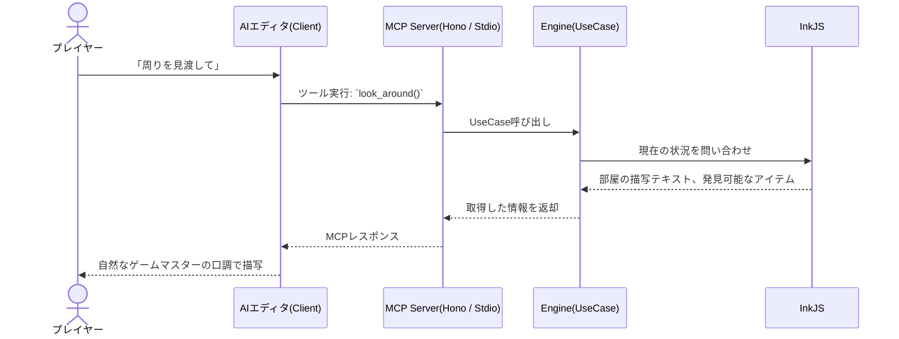

# ARCHITECTURE.md - システムアーキテクチャ設計

## 1. 全体像

このプロジェクトは、AIエディタ（MCPクライアント）と本システム（MCPサーバー）の連携によって動作します。



## 2. コンポーネント構成とパッケージ管理

本プロジェクトは `pnpm workspace` を用いたモノレポ構成とし、以下の3つの主要パッケージから成り立ちます。

```text
adventure-mcp/
├── pnpm-workspace.yaml
├── package.json
│
├── cli/                 # CUIフロントエンド (対話型デバッグ用)
│   ├── package.json     # 依存: commander, prompts(or enquirer), chalk
│   └── src/
│       ├── commands/    # CLIコマンドルーティング (例: start, load)
│       ├── views/       # コンソール出力のフォーマッター (Chalk等)
│       └── index.ts     # エントリポイント
│
├── mcp-server/          # MCPサーバー層
│   ├── package.json     # 依存: @modelcontextprotocol/sdk, @modelcontextprotocol/hono, hono, zod
│   └── src/
│       ├── transports/  # トランスポート層の切り替え (stdio.ts, sse.ts)
│       ├── tools/       # MCP Toolsの定義とハンドラ (engineのUseCaseを呼ぶ)
│       ├── resources/   # MCP Resourcesの定義
│       └── index.ts     # 起動引数等で stdio か sse(Hono) を選択して起動
│
└── engine/              # 共通ゲームエンジン（ヘキサゴナルアーキテクチャ）
    ├── package.json     # 依存: inkjs
    ├── assets/          # シナリオデータ (.ink / .json) 等のI/O対象
    └── src/
        ├── index.ts                 # engineの公開API (UseCaseのエクスポート)
        ├── application/
        │   └── usecase/             # Primary Ports: cli/mcpからの呼び出し口
        ├── domain/                  # Core: InkJS のラッパーや状態・ルールの表現
        ├── ports/                   # Secondary Ports: 外部依存処理のインターフェース
        └── infrastructure/          # Adapters: Portsの実装 (fsを用いたI/O)
```

`cli` と `mcp-server` の `package.json` には、`"engine": "workspace:*"` を指定し、ローカルパッケージとして連携します。

## 3. 開発・実行環境

モノレポでの開発体験（DX）を最大化するため、トランスパイル（ビルド）ステップを排除したモダンな実行環境を採用します。

- **モジュールエクスポート**: `engine` などのパッケージは、コンパイル済みのJSファイルではなく、`src/index.ts` を直接エクスポートします。
- **デバッグ時**: `tsx` を使用して、ビルドなしで即座に実行・検証を行います。エディタの型解決と完全に一致したシームレスな開発が可能です。
- **リリース・本番時**: Node.js の `--experimental-strip-types` (Type Strip機能) を利用し、TSファイルを直接実行します。これにより `tsup` などのバンドラーは不要となります。

## 4. engineの内部設計 (ヘキサゴナルアーキテクチャ)

`engine` パッケージはファイルI/Oの責務を持ちますが、ドメインロジックが特定のインフラに依存しないよう、**ヘキサゴナルアーキテクチャ (Ports and Adapters)** を採用します。

1. **UseCase層 (Primary Ports)**
   - `cli` や `mcp-server` などの外部パッケージは、InkJS等のドメイン詳細を直接操作せず、必ずこのUseCase層を経由します。
   - 例: `StartGameUseCase`, `ChooseActionUseCase`
2. **Domain層 (Core)**
   - InkJS を使った状態管理やシナリオ進行の純粋なロジックを配置します。
3. **Ports & Adapters (Secondary Ports)**
   - シナリオファイルの読み込みやセーブデータの永続化に関するインターフェース (`ScenarioStoragePort` 等) を定義し、`infrastructure` 層で `fs` を用いて実装します。

## 5. セキュリティ・制約事項
- ファイルの読み書き(アクセス)は、`engine` 内のセーブデータ用ディレクトリおよびアセットディレクトリのみに制限します。
- サーバー側で常に `InkJS` の「現在の選択肢」に含まれるアクションであるかをバリデーションし、AIのハルシネーションによる不正な状態遷移を防ぎます。
