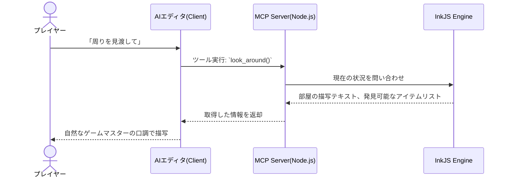

# ARCHITECTURE.md - システムアーキテクチャ設計

## 1. 全体像

このプロジェクトは、AIエディタ（MCPクライアント）と本システム（MCPサーバー）の連携によって動作します。

## 2. コンポーネント構成

### 2.1 MCP サーバー (TypeScript)
AIとゲームエンジンの橋渡し役です。以下の機能を提供します。
- **Tools**: AIが呼び出せるアクション群を定義します。
- **Resources**: 現在のプレイヤーステータス（所持アイテム、現在地）をAIが参照できるようにします。
- **セーブデータ管理**: ゲームの進行状況（Inkのステート）をローカルファイル（JSON等）に永続化します。

### 2.2 InkJS エンジン (ゲームロジック層)
アドベンチャーゲームの頭脳です。
- 事前にコンパイルされたシナリオデータ（JSON）を読み込みます。
- 現在のテキスト、選択肢（Paths）をMCPサーバーに提供します。
- 変数（アイテム取得フラグなど）を内部で厳格に管理します。

### 2.3 デバッグ用 CLI
AIを介さずに、CUIで直接シナリオをプレイ・テストするためのローカルツールです。

## 3. データフローと状態管理

1. **シナリオデータ**: `.ink` ファイルをコンパイルしてJSON形式で保存。
2. **プレイデータ**: セッションごとのプレイヤーの進行状況をファイル保存。
3. **情報制限**: MCPサーバーからAIへ渡す情報は、現在地の描写・現在の選択肢・プレイヤーの所持品のみに限定。

## 4. セキュリティ・制約事項
- アクセスはセーブデータ用ディレクトリのみに制限する。
- サーバー側で常に `InkJS` の「現在の選択肢」に含まれるアクションであるかをバリデーションし、AIのハルシネーションによる不正な遷移を防ぐ。
