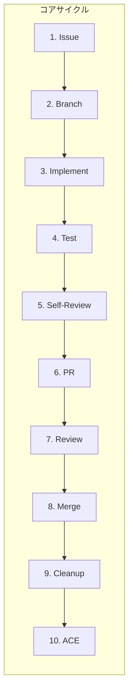

# AI駆動 Git Workflow

AI開発ツール（Claude Code、GitHub Copilot、Cursor）に最適化されたGit Flowベースのワークフローです。

> **このドキュメントについて**: 本ドキュメントはワークフロー全体の概要と流れを説明するハブドキュメントです。各ステップの詳細な手順やテンプレートは[関連ドキュメント](#関連ドキュメント)を参照してください。

## なぜAI駆動Git Workflowか

従来のGit Workflowに **テスト・セルフレビュー（PR作成前）** と **ACEナレッジ体系化（マージ後）** を組み込むことで、AIツールの力を最大限に活用します。

**従来のワークフロー**:

```
Issue → Branch → Commit → PR → Review → Merge
```

**AI駆動Git Workflow**:

```
Issue → Branch → Implement → Test → Self-Review → PR → Review → Merge → Cleanup → ACE
```

### 3つの革新ポイント

| ポイント                   | 従来              | AI駆動                                           |
| -------------------------- | ----------------- | ------------------------------------------------ |
| **テスト＋セルフレビュー** | 手動/省略されがち | ローカル品質ゲート＋AI ツールによる5観点チェック |
| **ACEナレッジ体系化**      | 属人的なメモ      | ACE Playbook + GitHub Discussionsに体系的蓄積    |
| **ドキュメント参照**       | 開発者依存        | コミットメッセージに doc 参照を含める            |

---

## コアサイクル（10ステップ）



### 各ステップの概要

| #   | ステップ        | 目的                       | AIツール活用                                                        |
| --- | --------------- | -------------------------- | ------------------------------------------------------------------- |
| 1   | **Issue作成**   | 作業の起点を明確化         | Issue 本文の自動生成                                                |
| 2   | **Branch作成**  | 作業を分離                 | -                                                                   |
| 3   | **Implement**   | AI駆動で実装・コミット     | コード生成、doc 参照の自動挿入                                      |
| 4   | **Test**        | テスト・型チェック・Lint   | ローカル品質（`npm run quality:local` 等。リモート Actions 非依存） |
| 5   | **Self-Review** | 品質を事前確保             | 5 観点の自動チェック＋ Review Toolkit                               |
| 6   | **PR作成**      | レビュー依頼               | PR 本文の自動生成                                                   |
| 7   | **Review**      | レビュー対応（修正ループ） | Review Router ＋修正提案の自動生成                                  |
| 8   | **Merge**       | Squash merge               | -                                                                   |
| 9   | **Cleanup**     | ブランチ同期・削除         | 次タスクの提案                                                      |
| 10  | **ACE**         | ナレッジ体系化（マージ後） | 知見の自動抽出・ Playbook 更新（develop で実行）                    |

---

## ブランチ戦略（Git Flow準拠）

```
main/master    ← 本番リリース（常時デプロイ可能）
  ↑
develop       ← 開発統合（次期リリース候補）
  ↑
feature/*     ← 機能開発（Issueベース）
hotfix/*      ← 緊急修正（mainから分岐）
release/*     ← リリース準備（developから分岐）
```

**注**: この図は主なコードの流れを示しています。`release`ブランチや`hotfix`ブランチは`main`と`develop`の両方にマージされるなど、実際のフローはより複雑になる場合があります。

### ブランチ命名規則

| タイプ   | パターン                            | 例                          |
| -------- | ----------------------------------- | --------------------------- |
| 機能開発 | `feature/{issue-num}-{description}` | `feature/123-user-auth`     |
| 緊急修正 | `hotfix/{issue-num}-{description}`  | `hotfix/456-security-patch` |
| リリース | `release/{version}`                 | `release/1.2.0`             |

---

## 運用原則

本ワークフローは以下の原則に従って運用します。詳細は [workflow-principles.md](../docs-template/05-operations/deployment/workflow-principles.md) を参照してください。

| 原則                         | 概要                                        |
| ---------------------------- | ------------------------------------------- |
| **ノンストップフロー**       | Issue作成〜PR作成まで不要確認なしで一気通貫 |
| **スコープ外発見のIssue化**  | その場で修正せず新規Issue作成               |
| **曖昧仕様の確認タイミング** | Issue着手前に確認、作業開始後は別Issue化    |
| **TodoWrite タスク管理**     | 標準チェックリストで進捗を可視化            |

---

## 詳細ステップ

### ステップ1: Issue作成

**原則**: 全ての作業は必ずIssueから開始

#### 6 観点フレームワーク（仮定を排除する）

書籍 第2章「AIが苦手なのは"コーディング"ではなく"心を読むこと"」では、**AI が事故を起こす最大の原因は「曖昧な仕様を AI が独自の仮定で補完する」こと**だと指摘されています。Issue 着手前に以下 6 観点をすべて言語化することで、AI への指示の曖昧さを最小化します。

| 観点                         | 確認事項                                       |
| ---------------------------- | ---------------------------------------------- |
| **What**（何を作る）         | 実現する機能の対象範囲                         |
| **How**（どう実現する）      | 採用するアプローチ／アルゴリズム／既存パターン |
| **Where**（どこに配置する）  | ファイル・モジュール・レイヤー                 |
| **Constraint**（制約は何か） | 性能・互換性・依存関係・禁止事項               |
| **Format**（入出力の形式は） | 引数・戻り値・スキーマ・エラー型               |
| **Test**（どう検証する）     | ユニット／統合／手動の判定基準                 |

> **運用**: 本リポジトリでは [`.github/ISSUE_TEMPLATE/feature.md`](../.github/ISSUE_TEMPLATE/feature.md) に 6 観点チェックリストを組み込んでいます。1 つでも空欄のまま着手すると、AI は「もっともらしい仮定」で穴埋めするため、必ず Issue 着手前に埋めてください。空欄のまま走らせると後工程で手戻りが発生します。

```bash
# GitHub CLIでIssue作成
gh issue create \
  --title "feat: ユーザー認証機能を実装" \
  --body "## 概要
[実装内容の説明]

## 受入基準
- [ ] 基準1
- [ ] 基準2" \
  --label "enhancement"
```

**AIツールへのプロンプト例**:

```
「ユーザー認証機能のIssueを作成してください。
6 観点（What / How / Where / Constraint / Format / Test）が
すべて埋まるようテンプレートに沿って記述してください。」
```

### ステップ2: Branch作成

```bash
git checkout develop
git pull origin develop
git checkout -b "feature/123-user-auth"
```

### ステップ3: Implement（AI駆動実装・コミット）

**重要**: コミットメッセージに参照したドキュメントを含める

#### 作業中の判断ログ: `implementation-notes.md` を並走させる

実装着手と同時に **作業ブランチ直下** に `implementation-notes.md` を作成し、コミットと一緒に追記する。コミット diff には残らない「なぜこの選択をしたか / spec から変えた点 / 捨てた選択肢」を保持することで、ステップ5（Self-Review）の精度とステップ10（ACE Generate）の入力品質が上がる。詳細根拠は [ACE-034](../docs-template/08-knowledge/PLAYBOOK.md#ace-034)。

最小ひな形（コピペして使う）:

```markdown
# Implementation Notes - #<ISSUE_NUM>

## Decisions not in spec

-

## Changes from spec

-

## Tradeoffs

-

## Open questions / TODO

-
```

**運用ルール**:

- **書くタイミングは「気付いた瞬間」**: 後で書こうとすると確実に忘れる（ACE-032 の発見経緯と同じ構造）
- **粒度は 1〜3 行**: 「なぜ A ではなく B を選んだか」を短文で残す
- **スコープ外発見は本ファイルではなく Issue 化**: implementation-notes は「現 PR の判断ログ」、Issue は「別タスクへの分岐」と役割を分ける（[ワークフロー運用原則 原則2](../docs-template/05-operations/deployment/workflow-principles.md)）
- **PR 作成時に PR description に転記**: ステップ6 でレビュアーが「なぜ」を読みやすくなる
- **マージ前にファイルを削除する（推奨）**: 本リポは squash merge 標準のため、ファイルを残すと次 PR がルート直下で衝突する。pr-ready 直前に PR description へ転記 → `git rm implementation-notes.md` → 1 commit で削除。長期保存したい場合は `notes/<issue-num>.md` 形式で per-PR ファイル化する代替案あり（並行 PR で衝突しないが notes/ が累積するトレードオフ）

#### コミット

```bash
git commit -m "feat: ユーザー認証機能を実装

- JWTベースの認証ミドルウェアを追加
- ログイン/ログアウトAPIを実装

参照:
- docs-template/MASTER.md#技術スタック (認証方式)
- docs-template/03-implementation/PATTERNS.md#3-エラーハンドリング (エラーハンドリング)

Closes #123"
```

### ステップ4: テスト・検証（Test）

**目的**: 実装の品質を客観的な指標で確認する

#### テスト・品質ゲートの実行

**本リポジトリ（`feel-flow/ai-spec-driven-development`）**では、PR 前にルートで次を実行する（リモート GitHub Actions には依存しない）。詳細は [NO_GITHUB_ACTIONS_MIGRATION_DESIGN.md](./NO_GITHUB_ACTIONS_MIGRATION_DESIGN.md) を参照。

```bash
npm run quality:local
```

**汎用プロジェクト向けの例**（各リポジトリの `package.json` に従う）:

```bash
# Linter（静的解析）
npm run lint

# 型チェック
npm run type-check

# テスト実行+カバレッジ
npm run test -- --coverage

# セキュリティスキャン
npm audit --audit-level=moderate
```

#### 合格基準

| 項目             | 基準                    |
| ---------------- | ----------------------- |
| Linter           | エラー0件               |
| 型チェック       | エラー0件               |
| テストカバレッジ | 80%以上                 |
| セキュリティ     | moderate以上の脆弱性0件 |

**ポイント**: 全テスト通過後にセルフレビュー（ステップ5）へ進む

#### 完了基準: 80% ルール

書籍 第13章「それ、結局エンジニアが全部書くのでは？」では、AI 駆動開発において「**完璧な 100% を目指して延々と磨き続けるより、80% で出して回した方が結果的に品質が上がる**」と整理されています。本リポジトリではステップ4（Test）通過後に以下の 3 観点で「80% に到達したか」を判断します。

| 観点                 | 80% の意味                                                            | 残り 20% の扱い                       |
| -------------------- | --------------------------------------------------------------------- | ------------------------------------- |
| **機能面**           | 主要ケース（ハッピーパス + 主要なエラーパス）が動く状態               | エッジケースは別 Issue 化して継続改善 |
| **テスト面**         | ユニット＋統合テストで主要フローをカバー（カバレッジ 80% 以上が目安） | 細部のパラメタライズは ACE 後に追加   |
| **パフォーマンス面** | ボトルネックを特定済みで現状値が許容範囲内                            | 微最適化は計測ベースで段階的に        |

**運用ルール**:

- 80% を超えたら **PR を出す** — レビューで残り 20% の優先度を判断する
- 残り 20% は **別 Issue に切り出して継続改善** — 同じ PR で抱え込まない（[ステップ6 の PR サイズ目安](#pr-サイズの目安200-行--400-行ルール)とも整合）
- 「100% でないとマージできない」と感じたら、その判断基準が **本当にビジネス価値に紐付いているか** を疑う（過剰品質はリリース速度を落とす）

> **対比**: 80% ルールは「品質を妥協してよい」という意味ではなく、「**完璧主義のコスト**を意識的に管理する」という意味。Critical / Warning レベルの指摘は 100% 対応する（[Review Response Policy](../docs-template/05-operations/deployment/review-response-policy.md)）。

### ステップ5: Self-Review（セルフレビュー）

**目的**: PRレビュー時の単純な指摘を事前に防ぐ

#### 5つの観点

| 観点                            | チェック内容                                        |
| ------------------------------- | --------------------------------------------------- |
| 1. コーディング規約             | マジックナンバー、型安全性、命名規則                |
| 2. 仕様との整合性               | PROJECT.md、ARCHITECTURE.md、DOMAIN.mdとの整合      |
| 3. テスト充実度                 | カバレッジ80%以上、エッジケース、エラーハンドリング |
| 4. パフォーマンス・セキュリティ | N+1問題、入力サニタイズ、認証・認可                 |
| 5. ドキュメント更新             | README、API仕様書の更新要否                         |

#### AIツールへのプロンプト例

```
「以下の観点で、今回のコミット内容をレビューしてください：

1. コーディング規約（docs-template/MASTER.md、docs-template/03-implementation/PATTERNS.md）
2. 仕様との整合性（docs-template/01-context/PROJECT.md、docs-template/02-design/ARCHITECTURE.md、docs-template/02-design/DOMAIN.md）
3. テスト充実度（docs-template/04-quality/TESTING.md）
4. パフォーマンスとセキュリティ
5. ドキュメント更新の必要性

各観点について、問題点と改善提案を具体的に指摘してください。」
```

#### セルフレビュー結果のPR記載例

```markdown
## セルフレビュー結果

### 1. コーディング規約

- ✅ マジックナンバー: 全て定数化済み
- ✅ 型安全性: any型使用なし

### 2. 仕様との整合性

- ✅ PROJECT.md#3.2の要件を全て実装

### 3. テスト充実度

- ✅ カバレッジ: 85.3%

### 4. パフォーマンス・セキュリティ

- ✅ N+1クエリ: 問題なし

### 5. ドキュメント更新

- ✅ README.md: 認証セクションを追加
```

#### Review Toolkit（Claude Code サブエージェント）

セルフレビューではClaude Codeのpr-review-toolkitサブエージェントも活用できます：

| サブエージェント        | 役割                       | 主な検出対象                       |
| ----------------------- | -------------------------- | ---------------------------------- |
| `code-reviewer`         | コード品質の包括的レビュー | 設計問題、命名規則違反、コード重複 |
| `silent-failure-hunter` | エラーハンドリング漏れ検出 | 未処理例外、空catch、暗黙的失敗    |
| `type-design-analyzer`  | 型設計の妥当性分析         | any型使用、型の粒度不足            |
| `pr-test-analyzer`      | テスト品質の分析           | カバレッジ不足、エッジケース欠落   |
| `comment-analyzer`      | コメント・ドキュメント品質 | 不正確なコメント、JSDoc欠落        |
| `code-simplifier`       | 複雑度の削減提案           | 長関数、深いネスト                 |

#### デュアルモデルレビュー（Claude + Codex）

Toolkit レビュー後、Codex CLI でクロスモデルレビューを実行し、異なるAIモデルの観点でレビュー品質を向上させます：

```bash
bash scripts/codex-review.sh --branch
```

レビュー結果は [Review Response Policy](../docs-template/05-operations/deployment/review-response-policy.md) に従って対応（Critical/Warning は確認不要で即対応）。TodoWrite で対応項目を管理します。

### ステップ6: PR作成

#### PR サイズの目安（200 行 / 400 行ルール）

書籍 第1章「AIに全部任せようとして事故る典型パターン」では、**PR が大きすぎるとレビュー見落としが急増し、AI が生成した不適切なコードがそのままマージされる**事故パターンが報告されています。本リポジトリでは **200 行 / 400 行の 2 つの閾値** で 3 段階の目安を設けて PR サイズをコントロールします（行数は **追加 + 削除**、生成物・lockfile を除く）。

| 区分      | 差分行数    | 取り扱い                                                                                                                      |
| --------- | ----------- | ----------------------------------------------------------------------------------------------------------------------------- |
| ✅ 推奨   | 200 行以下  | そのまま PR として提出可                                                                                                      |
| ⚠️ 警告   | 201〜400 行 | レビュー見落としリスク増加。**理由を Summary に明記**したうえで、可能なら分割                                                 |
| 🚨 要分割 | 401 行以上  | **原則として分割を推奨**。分割困難な場合は「レビュー観点ガイド」（読む順序・前提コンテキスト・重点確認箇所）を Summary に記載 |

**運用**:

- PR 作成時は [`.github/pull_request_template.md`](../.github/pull_request_template.md) の **PR Size Check** チェックリストで該当区分を選択する
- 大型 refactor などやむを得ず 400 行を超える場合は、Cross-Model Review（Toolkit + Copilot review、必要なら Codex CLI）を必ず併用する
- ファイルの単純な移動・rename・自動生成物が大半を占める場合は、その旨を Summary に明記すれば 400 行超でも分割不要

```bash
gh pr create \
  --base develop \
  --title "feat: ユーザー認証機能を実装" \
  --body "## 概要
...

## セルフレビュー結果
[上記の結果を記載]

Closes #123"
```

### ステップ7: Review（レビュー対応）

**重要**: レビュー指摘には**必ずスレッド形式で返信**

#### 良いコメントの例

```markdown
@reviewer-name 様

ご指摘ありがとうございます。修正いたしました。

## 修正内容

- `validateToken` 関数のエラーハンドリングを改善
- カスタムエラークラス `TokenExpiredError` を導入

## 変更箇所

- src/middleware/auth.ts:45-67

## 修正の理由

期限切れと不正トークンを区別することで、クライアント側で
適切なエラーメッセージを表示できるようにしました。

ご確認のほど、よろしくお願いいたします。
```

### ステップ8: Merge

```bash
# developブランチに切り替えてからマージ
git checkout develop
gh pr merge <PR番号> --squash --delete-branch
```

**注**: `feature`ブランチにはSquash mergeが適していますが、`release`や`hotfix`ブランチを`main`にマージする際は、コミット履歴を保持するために通常のmerge (`--merge`) を検討してください。

### ステップ9: Cleanup

PRのマージ後、ローカル環境を同期します。

```bash
git pull origin develop

# リモートで削除済みの追跡ブランチをローカルから一括削除
git fetch --prune
```

**注**: ステップ8で `gh pr merge --delete-branch` を実行したため、リモートのフィーチャーブランチは自動的に削除されています。ローカルのフィーチャーブランチは、マージ前に `develop` へ切り替えているため、手動で `git branch -d feature/123-user-auth` を実行するか、`gh` コマンドのインタラクティブなプロンプトに従って削除する必要があります。`git fetch --prune` は、他の開発者がマージして削除したブランチなど、リモートで削除済みの追跡ブランチをローカルから一括で削除するために役立ちます。

### ステップ10: ACE（ナレッジ体系化）

**目的**: 開発で得た知見をチーム資産として蓄積

**実行タイミング**: マージ後・cleanup 後（develop ブランチで実行）

> **書籍ギャップとの関係**: 当初は「ステップ 8: ACE（マージ前、feature branch で実行）」としていたが、PR レビュー指摘の修正サイクルが完了してから知見が確定するパターンが多く、マージ後 develop で実行する方が自然なフローになる（PR #395 ・PR #396 で順序見直し）。

#### 記録対象

- レビュー指摘と対応方法
- 技術的困難の解決策
- 新技術・ライブラリの導入知見
- パフォーマンス改善の手法
- セキュリティ対策の実装

#### AIツールへのプロンプト例

```
「今回のIssue #123とPR #456の内容を分析し、
GitHub Discussionsに登録すべきナレッジを抽出してください。

以下を含めてMarkdownを生成してください：
1. タイトル: 問題を端的に表現
2. カテゴリ: トラブルシューティング/ベストプラクティス/技術選定 など
3. 問題の概要
4. 解決方法（コード例含む）
5. 学んだこと」
```

#### GitHub Discussionsへの登録

```bash
gh discussion create \
  --category "ベストプラクティス" \
  --title "[JWT認証] トークンリフレッシュのエラーハンドリング" \
  --body-file knowledge.md
```

#### 運用パターン（マージ方針）

> ACE 知見コミットのマージ方針の SSOT は [docs-template ステップ10 §運用パターン（マージ方針）](../docs-template/05-operations/deployment/git-workflow.md#ace-merge-policy)。本リポジトリでも同方針を適用する。

**既定（推奨）— develop 直マージ**: マージ・cleanup 後の develop で `/ace-curate <PR番号>` を実行し、PLAYBOOK.md 追記を develop に直接 commit + push する。PLAYBOOK.md は append-only で構造化されており、ID も PRスコープ式（[エントリID規則](../docs-template/08-knowledge/PLAYBOOK.md#エントリid規則)）で衝突しないため、ACE 1 サイクル分の小さな知見追加を毎回 PR 化するのは過剰なオーバーヘッド。

**任意エスカレーション — chore PR**: 大人数チーム、または知見内容自体をレビューに残したい場合のみ、develop から `chore/ace-from-pr-<PR番号>` ブランチを切り、PLAYBOOK.md 追記を小さい chore PR として PR レビュー → squash merge する。

> **ACE-012 との関係（混同しないこと）**: [ACE-012](../docs-template/08-knowledge/PLAYBOOK.md#ace-012) は「うっかり」feature 作業を develop に直接 push してしまう事故（ブランチ切り替わりの見落とし）を防ぐルール。一方、本セクションの「develop 直マージ」は `knowledge:` プレフィックス付きの PLAYBOOK 単独コミットに限定した「意図的・承認済み」のフローであり、両者は別物。ACE-012 は引き続き有効（deprecated にしない）。

---

## ベストプラクティス

### Issue駆動開発

- 全ての作業はIssueから開始
- Issue番号をブランチ名・コミットメッセージに含める
- Issueテンプレートで情報を標準化

### 小さく頻繁なコミット

- 機能単位で小さくコミット
- 変更理由を明確に記載
- 参照ドキュメントを含める

### AIツールの積極活用

- コード生成だけでなくレビューにも活用
- MASTER.md等のドキュメントを常に参照させる
- セルフレビューとナレッジ抽出を自動化

### PRサイズの管理

- 1つのPRは1つの機能に集中
- 変更ファイル数は10ファイル以内推奨
- 大きな変更は複数Issue/PRに分割
- 行数の数値目安（200 / 400 行）は [ステップ6 の PR サイズの目安](#pr-サイズの目安200-行--400-行ルール) を参照

---

## 関連ドキュメント

### テンプレート（実際のプロジェクトで使用）

- [git-workflow.md](../docs-template/05-operations/deployment/git-workflow.md) - 詳細ワークフロー
- [self-review.md](../docs-template/05-operations/deployment/self-review.md) - セルフレビュー詳細
- [review-response-policy.md](../docs-template/05-operations/deployment/review-response-policy.md) - PRレビュー対応ポリシー
- [workflow-principles.md](../docs-template/05-operations/deployment/workflow-principles.md) - ワークフロー運用原則
- [multi-cli-review-orchestration.md](../docs-template/05-operations/deployment/multi-cli-review-orchestration.md) - Multi-CLI分散レビュー・クロスモデルレビュー
- [NO_GITHUB_ACTIONS_MIGRATION_DESIGN.md](./NO_GITHUB_ACTIONS_MIGRATION_DESIGN.md) - GitHub Actions非依存運用の移行設計（[Issue #377](https://github.com/feel-flow/ai-spec-driven-development/issues/377)）
- [knowledge-management.md](../docs-template/05-operations/deployment/knowledge-management.md) - ナレッジ体系化詳細
- [automated-code-review.md](../docs-template/05-operations/deployment/automated-code-review.md) - 自動コードレビュー

### 関連概念

- [AI Spec Driven Development](./AI_SPEC_DRIVEN_DEVELOPMENT.md) - 7文書構造の概念
- [Operational Guide](./OPERATIONAL_GUIDE.md) - AIエージェント向け運用ガイド

---

## まとめ

AI駆動Git Workflowは以下を実現します：

1. **効率的な開発** - AIツールで開発速度を向上
2. **高品質なコード** - セルフレビューで品質を事前確保
3. **組織的な知見蓄積** - ナレッジ体系化でチーム全体のスキルアップ
4. **透明性の高いプロセス** - Issue駆動でトレーサビリティを確保
5. **継続的改善** - フィードバックループでプロセスを進化

ワークフローは形式ではなく、チームの生産性向上と品質確保のための手段です。状況に応じて柔軟に調整してください。
